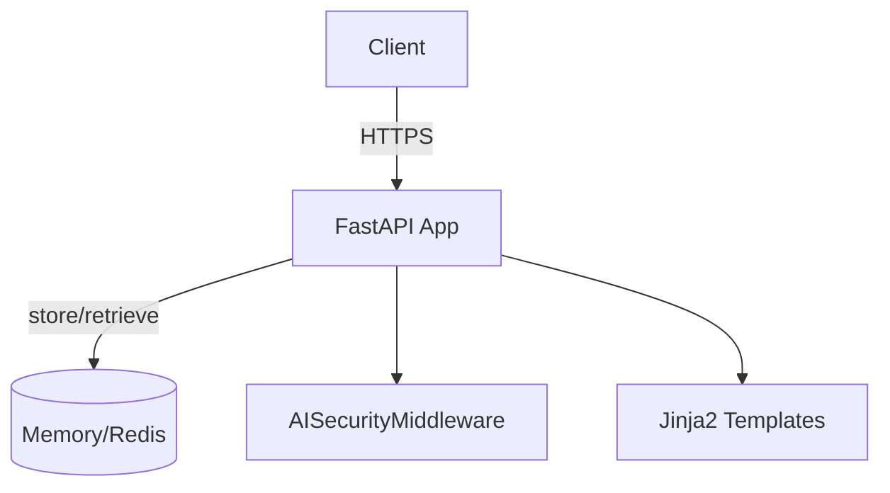

# Architecture

## Component Diagram

## Request Flow
1. Client sends encrypted payload to `POST /api/create`.
2. `AISecurityMiddleware` scans payload.
3. `main.py` persists ciphertext via storage backend.
4. Client receives secret ID.
5. Later, client requests `GET /api/secret/{id}`; backend returns ciphertext and deletes record.

## Deployment
- Containerized via Docker.
- CI builds image and optionally deploys to Google Cloud Run.
- Production recommends Redis for persistent storage and HTTPS with security headers.

See [API_CATALOG.md](API_CATALOG.md) for endpoint details.
